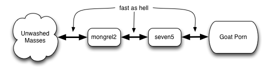

# Seven5:

<nav>
    <ul>
        <li>[Intro](index.html)</li>
        <li>[Install](install.html)</li>
        <li>[Develop](develop.html)</li>
        <li>[Pontificate](pontificate.html)</li>
    </ul>
</nav>

## An opinionated web framework written in go.

## Tactics we embrace like bacon on a cupcake:

### Demand a dev cycle like we're used to with interpreted languages.

### Make out with strong typing and a fast compiler.

### Develop and demo on a single machine but smoothly blow into the clouds.

### Don't repeat {yourself, others, the stack}.
